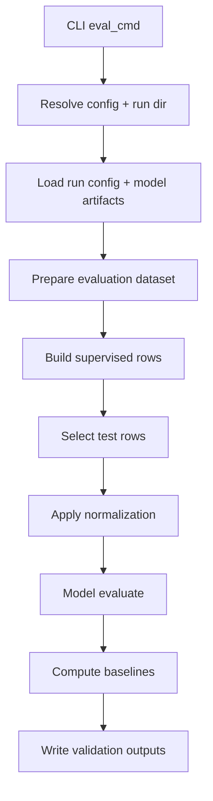

# Evaluation Deep Dive

This page describes how evaluation works after the CLI refactor.

## Module Boundaries

Evaluation now spans these modules:

- `src/cli_eval.py`: command entrypoint and multi-config orchestration
- `src/model_evaluation.py`: single-run evaluation, baseline computation, comparison row construction, cross-validation orchestration
- `src/data_pipeline.py`: evaluation data preparation and supervised-frame construction
- `src/artifact_io.py`: run-directory resolution and serialized artifact loading
- `src/plot_writer.py`: optional period/station metric charts
- `src/pipeline.py`: model evaluation API (`StationForecastPipeline.evaluate`)

The compatibility facade in `src/cli.py` still exposes legacy helper names used by tests and by thin command modules.

## Direct Function Links

Core evaluation entrypoints and orchestration:

- [eval_cmd()](../src/cli_eval.py#L15)
- [_eval_one()](../src/model_evaluation.py#L798)
- [_evaluate_run()](../src/model_evaluation.py#L433)
- [_run_cross_validation()](../src/model_training.py#L717)

Data preparation and baseline helpers:

- [_prepare_evaluation_data()](../src/data_pipeline.py#L1103)
- [_prepare_fold_training_inputs()](../src/data_pipeline.py#L1184)
- [_prepare_fold_validation_inputs()](../src/data_pipeline.py#L1242)
- [_compute_station_replacement_baselines()](../src/model_evaluation.py#L339)
- [_baseline_metrics()](../src/model_evaluation.py#L142)

Artifact loading and run resolution helpers:

- [_resolve_run_dir()](../src/artifact_io.py#L348)
- [_load_chunked_joblib()](../src/artifact_io.py#L117)
- [_load_saved_normalization_stats()](../src/artifact_io.py#L496)

## Entrypoints

- CLI command: `aq-spatial-reconstruction-eval`
- Python entry function: `eval_cmd` in `src/cli_eval.py`

For each config, `eval_cmd` delegates to `_eval_one` through the facade, then aggregates outputs into:

- `runs`: one payload per config
- `comparison`: multi-config metrics/baseline table plus CSV path (when applicable)

## Run Directory Resolution

When `--run-dir` is omitted, evaluation resolves a run in this order:

1. `artifacts.eval_run_dir`
2. `latest_run_<config-name>.txt`
3. `latest_run.txt`

Resolution logic is centralized in `src/artifact_io.py` and surfaced through the compatibility facade.

## Single-Run Evaluation Flow

## Cross-Validation Flow

If `eval.cross_validation.folds` is configured, evaluation runs fold-by-fold processing:

1. Build fold-specific train/eval slices
2. Fit fold model on fold train slice
3. Evaluate on fold validation slice
4. Write per-fold metrics and aggregate summary

Outputs are written under `validation/cross_validation/` in the selected run.

## Baselines

Evaluation appends baseline experiments next to model metrics:

- `Baseline: Average of Other Stations`
- `Baseline Replace with Station <station_id>`

These rows are carried into:

- per-run JSON payloads (`baseline_results`, `baseline_period_results` when enabled)
- multi-config comparison CSV rows (`algorithm` column contains baseline names)

## Per-Period Results

When `eval.separate_validation_period_results: true` is enabled:

- per-period artifacts are written under `validation/by_period/`
- comparison rows include period metadata columns
- baseline rows are emitted per period as well

Typical period columns:

- `validation_period_name`
- `validation_period_start`
- `validation_period_end`
- `validation_period`

## Output Artifacts

Core outputs under `<run-dir>/validation/`:

- `validation.csv`
- `metrics.json`
- optional `validation_details.csv`
- optional period-specific artifacts under `by_period/`

Additional outputs:

- station/period metric charts

## Metrics Shape

Single-target runs:

- `metrics.json` is a flat metric object (`MSE`, `RMSE`, `MAE`, `R2`, `IA`)

Multi-target runs:

- `metrics.by_target` contains one metric object per target pollutant

Comparison output preserves pollutant-specific keys instead of averaging across pollutants.

