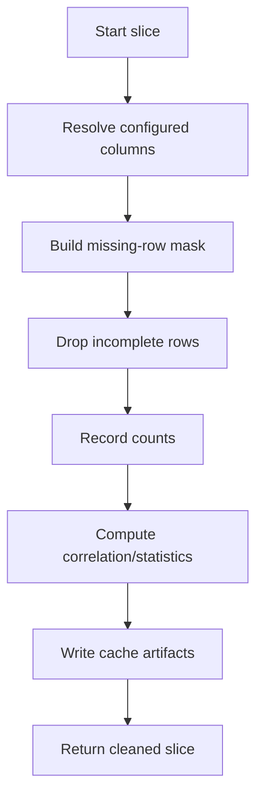

# Missing-Value Preprocessing

This page explains how missing values are handled in this repository.

## Where Preprocessing Runs

Missing-value preprocessing is executed from training/evaluation preprocessing:

- `_load_or_build_imputed_dataset()` orchestrates cache lookup/build.
- `_drop_rows_with_missing_values()` in `src/data_pipeline.py` removes incomplete rows.

Important: raw data slicing is done before missing-value handling (train slice, eval slice, or fold slice), so holdout periods are not used to shape training preprocessing artifacts.

## Inputs That Control Imputation

From config:

- `data.impute_columns`: columns checked for missing values.
- `data.rebuild_cache`: whether to force regeneration of preprocessing artifacts.

From code:

- Excluded structural fields are typically datetime and station id.
- Correlations are computed only on numeric columns after incomplete rows are dropped.

## Exact Algorithm

For each preprocessing slice, the code does:

1. Resolve configured `data.impute_columns` that exist in the dataframe.
2. Build a row mask where any configured column is missing.
3. Drop those rows.
4. Record dropped-row counts overall, per configured column, and per station when `data.station_id_col` is present.
5. Compute correlation analysis and missing-value statistics on the cleaned slice.
6. Write cache artifacts for reuse when the cache signature is unchanged.

## Mermaid Flowchart

**Graph legend (map node labels to functions):**

| Node | Label | Description |
|------|-------|-------------|
| A | Start slice | Begin preprocessing for a data slice |
| B | Resolve configured columns | Keep only configured columns present in the dataframe |
| C | Build missing-row mask | Mark rows missing any checked column |
| D | Drop incomplete rows | Remove marked rows |
| E | Record counts | Log dropped rows and before/after missing counts |
| F | Compute correlation/statistics | Compute diagnostics on the cleaned slice |
| G | Write cache artifacts | Persist cleaned data and diagnostics |
| H | Return cleaned slice | Return cleaned dataframe and correlation analysis |

## Artifacts Written

When preprocessing is built (or cache is refreshed), artifacts include:

- `imputed_dataset.csv`
- `imputation_details.json`
- `imputation_stats.json`
- `imputation_stats.csv`
- `correlation_analysis.json`
- `correlation_heatmap.png`
- `column_statistics_before.csv`
- `column_statistics_after.csv`
- `cache_metadata.json`

## Cache Behavior Clarification

`rebuild_cache: false` means:

- Reuse an existing cache only when the computed signature matches exactly.
- If signature differs, a new cache folder is created.

The signature includes:

- source file signatures (`path`, `size`, `mtime_ns`)
- key preprocessing config fields
- slice context (train/eval/fold + periods)

### Exact Signature Structure

Base signature keys (from `_imputation_cache_signature()`):

- `cache_format`
- `files`
- `datetime_col`
- `sort_col`
- `columns`
- `station_id_col`
- `station_id_from`
- `station_id_regex`
- `impute_columns`

Then, when preprocessing is called with context, one more key is added:

- `slice`

`slice` carries mode-specific values such as:

- `mode: train` + `train_years`, `train_periods`, `validation_periods_excluded`
- `mode: eval` + `validation_periods`
- `mode: cross_validation_train` or `cross_validation_eval` + fold metadata/periods

### What `path`, `size`, and `mtime_ns` Mean

Each source file contributes one object from `file_signature()`:

- `path`: absolute resolved file path (`Path.resolve()` output)
- `size`: file size in bytes (`stat().st_size`)
- `mtime_ns`: last modification timestamp in nanoseconds (`stat().st_mtime_ns`)

Why these matter:

- If file content changes, `size` and/or `mtime_ns` usually change.
- If a file is replaced/copied, `mtime_ns` often changes even when size is the same.
- If the source path changes, `path` changes.

Any of those differences can produce a different cache signature.

### Key Preprocessing Config Fields (Exact)

In this codebase, the preprocessing-related config fields included directly in the cache signature are exactly:

- `data.datetime_col`
- `data.sort_col` (or fallback to `data.datetime_col`)
- `data.columns`
- `data.station_id_col` (or fallback to `station_id`)
- `data.station_id_from` (or fallback to `auto`)
- `data.station_id_regex`
- `data.impute_columns`

Notes:

- `data.rebuild_cache` is not part of the signature; it forces regeneration when true.
- Slice context is included separately under `slice` when provided.

### How Cache Folder Name Is Calculated

Cache folder naming is deterministic and based on the full signature object:

1. Serialize signature as JSON with sorted keys.
2. Compute SHA-1 of that JSON text.
3. Use the first 12 hex characters as the cache directory name.

In code terms:

`sha1(json.dumps(signature, sort_keys=True).encode("utf-8")).hexdigest()[:12]`

So new cache directories can appear even with `rebuild_cache: false` when data files or slice context change.
