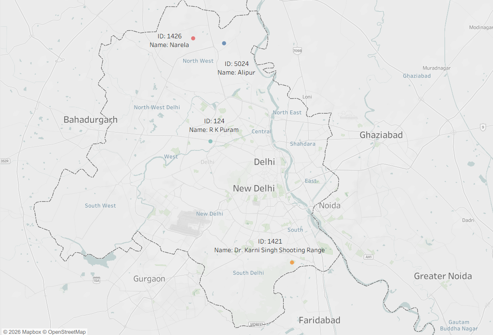
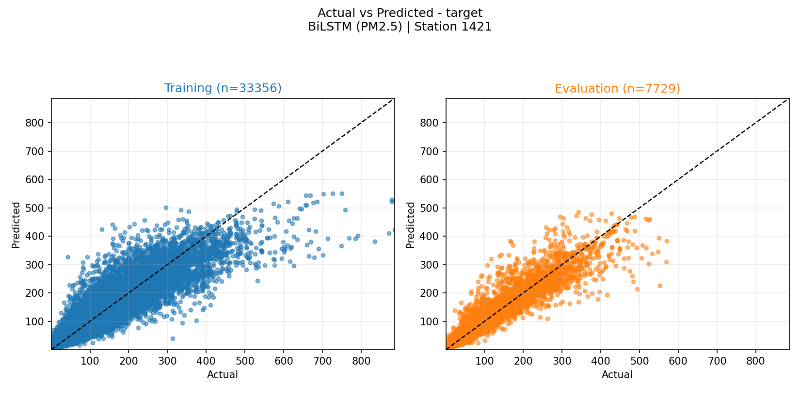
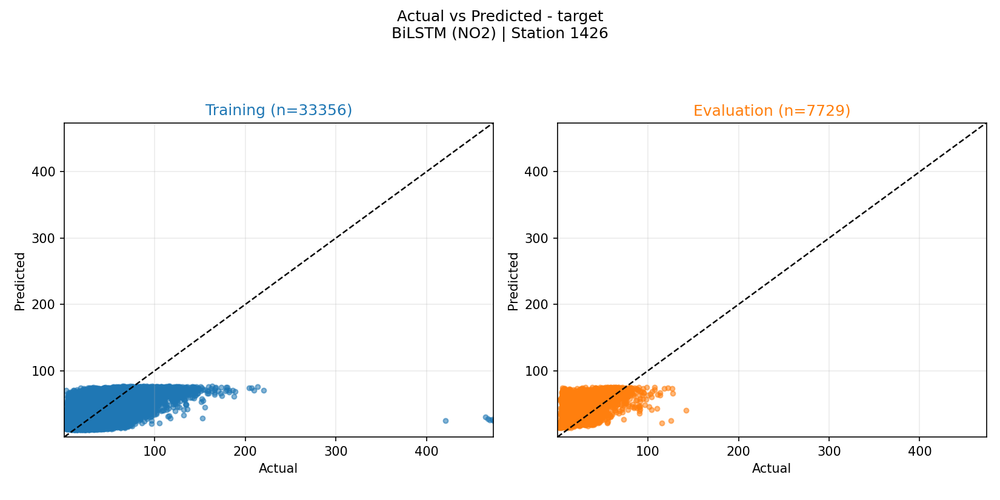

# Paper Supplementary Tables

The camera-ready version of the paper (accepted at ICT-DM'26) was tightened
to meet the conference page limit. Several tables of per-station /
per-fold detail were compressed to summary sentences in the paper text,
with a pointer back to this file. This document reproduces the full,
unabridged data that those tables originally contained, so results remain
fully reproducible and inspectable without re-running the pipeline.

Station IDs used throughout: `124` (R K Puram), `1421` (Karni Singh
Shooting Range), `1426` (Narela), `5024` (Alipur).

## 1. Best Hyperparameters Selected per Fold

Selected via random search (5 candidates per fold, 80 training jobs total),
scored by RMSE on the 2024 validation set. The paper now only summarizes
the dominant pattern per pollutant; the full per-fold selection is below.

### BiLSTM

| Pollutant | Station | LSTM units | Dropout | Learning rate | Batch size |
|---|---|---|---|---|---|
| PM2.5 | 124 (R K Puram) | [64, 32] | 0.2 | 1e-3 | 32 |
| PM2.5 | 1421 (Karni Singh) | [64, 32] | 0.1 | 1e-3 | 64 |
| PM2.5 | 1426 (Narela) | [64, 32] | 0.2 | 1e-3 | 32 |
| PM2.5 | 5024 (Alipur) | [64, 32] | 0.2 | 1e-3 | 32 |
| NO2 | 124 (R K Puram) | [32] | 0.2 | 0.5e-3 | 64 |
| NO2 | 1421 (Karni Singh) | [64, 32] | 0.1 | 0.5e-3 | 64 |
| NO2 | 1426 (Narela) | [64, 32] | 0.1 | 0.5e-3 | 64 |
| NO2 | 5024 (Alipur) | [64, 32] | 0.2 | 1e-3 | 32 |

### Extra Trees

`p` = number of input features (3).

| Pollutant | Station | Trees | Depth | min\_samples\_split | min\_samples\_leaf | max\_features |
|---|---|---|---|---|---|---|
| PM2.5 | All folds | 300 | 30 | 10 | 1 | sqrt(p) |
| NO2 | 124 (R K Puram) | 800 | 30 | 6 | 4 | log2(p) |
| NO2 | 1421 (Karni Singh) | 800 | 30 | 6 | 4 | log2(p) |
| NO2 | 1426 (Narela) | 300 | 30 | 10 | 2 | log2(p) |
| NO2 | 5024 (Alipur) | 300 | 30 | 10 | 2 | sqrt(p) |

## 2. Leave-One-Out Experimental Scenarios

Each of the four stations is held out in turn as the target, for each of
the two pollutants, giving eight reconstruction tasks. The predictor set
for each fold is always "the three stations not held out."

| Experiment | Target station | Target pollutant | Predictor stations |
|---|---|---|---|
| 1 | 124 (R K Puram) | PM2.5 | 1421, 1426, 5024 |
| 2 | 1421 (Karni Singh) | PM2.5 | 124, 1426, 5024 |
| 3 | 1426 (Narela) | PM2.5 | 124, 1421, 5024 |
| 4 | 5024 (Alipur) | PM2.5 | 124, 1421, 1426 |
| 5 | 124 (R K Puram) | NO2 | 1421, 1426, 5024 |
| 6 | 1421 (Karni Singh) | NO2 | 124, 1426, 5024 |
| 7 | 1426 (Narela) | NO2 | 124, 1421, 5024 |
| 8 | 5024 (Alipur) | NO2 | 124, 1421, 1426 |

## 3. Missing and Valid Observations — Training Period (2019–2023)

Each station has 43,824 total hourly records for 2019–2023 (including the
2020 leap year). The paper reports only the aggregate totals and the
resulting 92.7% joint retention rate; the per-station breakdown is below.

| Station | PM2.5 missing | PM2.5 valid | NO2 missing | NO2 valid |
|---|---|---|---|---|
| 124 (R K Puram) | 3,580 | 40,244 | 2,169 | 41,655 |
| 1421 (Karni Singh) | 2,011 | 41,813 | 2,390 | 41,434 |
| 1426 (Narela) | 1,441 | 42,383 | 1,515 | 42,309 |
| 5024 (Alipur) | 2,036 | 41,788 | 1,936 | 41,888 |
| **Total** | **9,068** | **166,228** | **8,010** | **167,286** |

Note: these per-pollutant totals count rows missing that pollutant alone;
the paper's headline retention figure (162,575 entries, 92.7%) is the
*joint* count of rows with both PM2.5 and NO2 present.

## 4. Descriptive Statistics by Period

Per-station PM2.5 / NO2 concentration statistics (mean ± standard
deviation, µg/m³), by period. The paper's Results & Discussion section
only quotes the two values needed for the Alipur distribution-shift
finding (Alipur NO2: 32.9 → 36.6; Narela NO2: 34.9 → 23.9, training →
testing); the full table is below.

### Training (2019–23)

| Station | PM2.5 | NO2 |
|---|---|---|
| 124 (R K Puram) | 106.0 ± 101.5 | 44.5 ± 31.7 |
| 1421 (Karni Singh) | 92.5 ± 91.9 | 51.5 ± 40.2 |
| 1426 (Narela) | 110.4 ± 100.7 | 34.9 ± 26.0 |
| 5024 (Alipur) | 103.1 ± 95.5 | 32.9 ± 25.1 |

### Validation (2024)

| Station | PM2.5 | NO2 |
|---|---|---|
| 124 (R K Puram) | 118.1 ± 104.7 | 36.8 ± 28.2 |
| 1421 (Karni Singh) | 102.1 ± 95.9 | 52.2 ± 31.2 |
| 1426 (Narela) | 107.6 ± 100.6 | 31.7 ± 22.6 |
| 5024 (Alipur) | 101.1 ± 99.2 | 31.2 ± 20.7 |

### Testing (2025)

| Station | PM2.5 | NO2 |
|---|---|---|
| 124 (R K Puram) | 110.3 ± 100.9 | 41.9 ± 26.5 |
| 1421 (Karni Singh) | 92.8 ± 88.5 | 49.6 ± 24.2 |
| 1426 (Narela) | 109.4 ± 101.5 | 23.9 ± 15.7 |
| 5024 (Alipur) | 100.6 ± 90.2 | 36.6 ± 22.4 |

## 5. Test-Period Performance (2025) by Station and Pollutant

Full RMSE / R² results for the multi-station-average baseline, BiLSTM, and
Extra Trees, across all eight folds. These values are still reported in
the paper's Results & Discussion prose and visualized in the two
bar-chart figures (Figs. 1–2); this table gives the single consolidated
view that the camera-ready version no longer has room for.

RMSE in µg/m³. Bold marks the best result per row.

### PM2.5

| Station | Baseline (avg) RMSE | Baseline (avg) R² | BiLSTM RMSE | BiLSTM R² | Extra Trees RMSE | Extra Trees R² |
|---|---|---|---|---|---|---|
| 124 (R K Puram) | 47.89 | 0.780 | **40.87** | **0.840** | 41.39 | 0.836 |
| 1421 (Karni Singh) | 39.63 | 0.801 | **31.02** | **0.878** | 31.09 | 0.877 |
| 1426 (Narela) | 42.34 | 0.831 | **35.46** | **0.881** | 36.09 | 0.877 |
| 5024 (Alipur) | 40.90 | 0.800 | **32.50** | **0.874** | 32.59 | 0.873 |

### NO2

| Station | Baseline (avg) RMSE | Baseline (avg) R² | BiLSTM RMSE | BiLSTM R² | Extra Trees RMSE | Extra Trees R² |
|---|---|---|---|---|---|---|
| 124 (R K Puram) | 19.27 | 0.490 | **19.10** | **0.499** | 20.52 | 0.422 |
| 1421 (Karni Singh) | 24.06 | 0.044 | 20.71 | 0.292 | **19.35** | **0.381** |
| 1426 (Narela) | 26.34 | −1.74 | 19.92 | −0.564 | **18.07** | **−0.288** |
| 5024 (Alipur) | **15.46** | **0.519** | 19.83 | 0.208 | 19.52 | 0.233 |

## 6. Removed Figures

Two figures from the pre-camera-ready draft are not in the published
paper. Both are reproduced below and saved under [`figs/`](figs); they are
also regenerable from this repository's outputs via the plotting CLI
described in [Plotting Deep Dive](plotting.md).

### Station locations map

Plots the four station coordinates from Table 1 in the paper (also listed
as the station list at the top of this document) over a map of Delhi.

### Predicted-vs-observed scatter plots

Best-case PM2.5 fold (Karni Singh, BiLSTM: RMSE 31.0 µg/m³, R² 0.878) and
worst-case NO2 fold (Narela, BiLSTM: RMSE 19.9 µg/m³, R² −0.564). Each
image below shows both the training-period fit (left) and the 2025
evaluation period (right); the paper cropped to the evaluation panel only.

