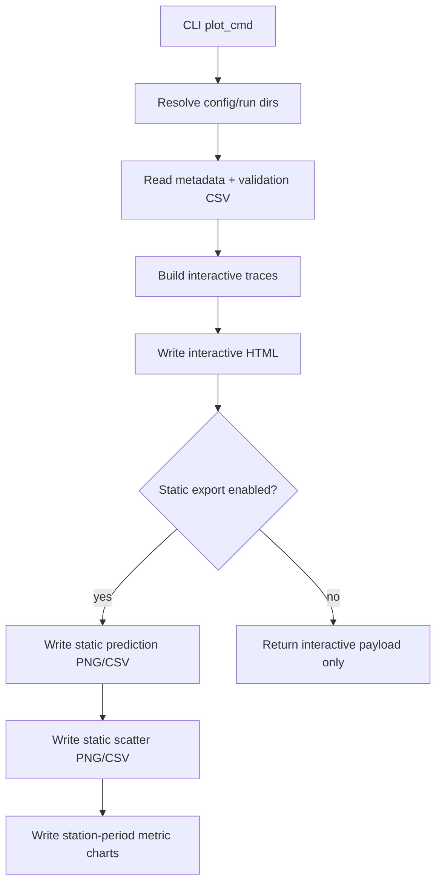

# Plotting Deep Dive

This page explains how `aq-spatial-reconstruction-plot` works after the CLI refactor.

## Module Boundaries

Plot generation now uses:

- `src/cli_plot.py`: command parsing and orchestration
- `src/plot_writer.py`: interactive/static/scatter/metrics chart writers
- `src/artifact_io.py`: run-dir and metadata resolution helpers
- `src/model_evaluation.py`: comparison-row shaping used for metrics charts

The compatibility facade in `src/cli.py` forwards these helpers for backward compatibility.

## Direct Function Links

Plot command entry and run resolution:

- [plot_cmd()](../src/cli_plot.py#L14)
- [_resolve_plot_run_dirs()](../src/plot_writer.py#L2184)

Series collection and writer functions:

- [_collect_prediction_plot_series()](../src/plot_writer.py#L1084)
- [_write_interactive_prediction_plot()](../src/plot_writer.py#L1853)
- [_write_static_prediction_plots()](../src/plot_writer.py#L1414)
- [_write_static_actual_prediction_scatter_plots()](../src/plot_writer.py#L1509)

Metadata labeling helper:

- [_resolve_algorithm_display_name_from_metadata()](../src/artifact_io.py#L589)

## What Plotting Reads

Plotting does not read raw station CSVs. It reads saved run artifacts, primarily:

- `<run-dir>/run_metadata.json`
- `<run-dir>/validation/validation.csv`
- optional `<run-dir>/training_dump/*.csv` for training-vs-testing scatter views

This means the usual flow is:

1. Train
2. Evaluate
3. Plot evaluation artifacts

## Entrypoint

- CLI command: `aq-spatial-reconstruction-plot`
- Python entry function: `plot_cmd` in `src/cli_plot.py`

`plot_cmd` resolves run directories from either explicit `--run-dir` values or config-driven run markers, then writes outputs into a timestamped folder.

## Run Resolution

If configs are supplied without explicit run dirs, each run is resolved by this order:

1. matching `--run-dir` value (if provided)
2. `artifacts.eval_run_dir`
3. `latest_run_<config-name>.txt`
4. `latest_run.txt`
5. newest run directory fallback

## Plotting Flow



## Output Layout

Base output directory:

- `--output-dir` if provided
- otherwise config-derived outputs directory

Each invocation writes into a new timestamped directory under that base path.

Typical payload fields returned by the command include:

- `interactive_plot`
- `static_prediction_plots`
- `static_actual_prediction_scatter_plots`
- `station_period_metric_charts`
- `comparison` (when available)
- `output_base_dir`
- `output_dir`

## Static and Interactive Behavior

- Interactive HTML is always generated.
- Static export is enabled by default and can be disabled with `--no-static`.
- Legend placement for interactive output can be controlled with `--legend`.
- Output comments can be applied using `--comment` to scope output folders.

## YAML Options Affecting Plotting

Plot behavior can be shaped through config keys such as:

- `plot.title_templates`
- `plot.metrics_graph.metrics`
- `plot.metrics_graph.group_output_by`
- `plot.metrics_graph.comparison_mode`

When multiple prediction periods are configured, static artifacts are emitted per period-compatible naming conventions.

## Example

```bash
aq-spatial-reconstruction-plot --config-dir configs/delhi --legend right
```

This resolves each config run, writes interactive HTML plus static artifacts (unless disabled), and returns a JSON payload with all output paths.
