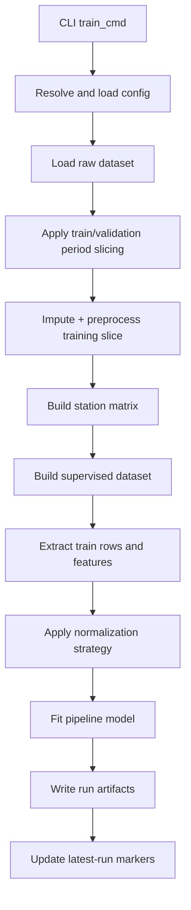

# Training Process Internals

This document describes the training pipeline after splitting the original monolithic CLI into focused modules.

## Module Boundaries

Training now spans these modules:

- `src/cli_train.py`: command entrypoint and multi-config orchestration
- `src/model_training.py`: single-run training and optimization workflow
- `src/data_pipeline.py`: data loading, period slicing, imputation, supervised-frame creation
- `src/config_loader.py`: config expansion/inheritance and run-phase reporting
- `src/artifact_io.py`: run-dir creation and model/artifact serialization
- `src/pipeline.py`: estimator construction and fit/evaluate wrapper

`src/cli.py` remains as a compatibility facade exporting legacy helper names.

## Direct Function Links

Training command and orchestration:

- [train_cmd()](../src/cli_train.py#L13)
- [_train_one()](../src/model_training.py#L491)
- [_load_cfg()](../src/config_loader.py#L221)

Data loading and preparation:

- [_load_input_dataset()](../src/data_pipeline.py#L68)
- [_filter_raw_df_by_periods()](../src/data_pipeline.py#L461)
- [_exclude_raw_df_by_periods()](../src/data_pipeline.py#L483)
- [_load_or_build_imputed_dataset()](../src/data_pipeline.py#L695)
- [_build_supervised_frame()](../src/data_pipeline.py#L921)
- [_prepare_training_data()](../src/data_pipeline.py#L975)

Artifact helpers used during training output:

- [_dump_training_inputs()](../src/model_training.py#L417)

## Entrypoint

- CLI command: `aq-spatial-reconstruction-train`
- Python entry function: `train_cmd` in `src/cli_train.py`

`train_cmd` expands configs, runs each config sequentially, and returns:

- single-run payload when one config is provided
- a `runs` list when multiple configs are provided

## Training Flow

## Data Leakage Guardrails

The design keeps leakage controls explicit:

- training slice selection happens before imputation
- normalization statistics are computed from training inputs
- evaluation reuses saved train stats (unless explicitly disabled)

This ensures holdout windows are not used to learn training-time preprocessing statistics.

## Artifact Outputs

A training run writes a timestamped run directory under the configured artifact root.

Common outputs include:

- `pipeline.pkl.part*`
- `config_snapshot.yaml`
- `run_metadata.json`
- `norm_stats.json` (when enabled)
- imputation and correlation diagnostics
- optional training dumps (`training_dump/`)

Each run also updates:

- `latest_run.txt`
- `latest_run_<config-name>.txt`

## Multi-Config Training

When multiple configs are passed (`--config` or `--config-dir` expansion):

- each config is trained independently
- results are emitted under `runs`

## Related Documentation

- evaluation internals: `docs/evaluation.md`
- plotting internals: `docs/plotting.md`
- config keys and behaviors: `docs/configuration.md`
